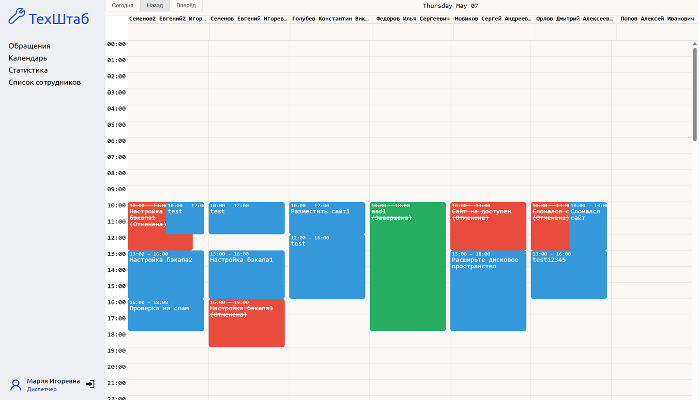
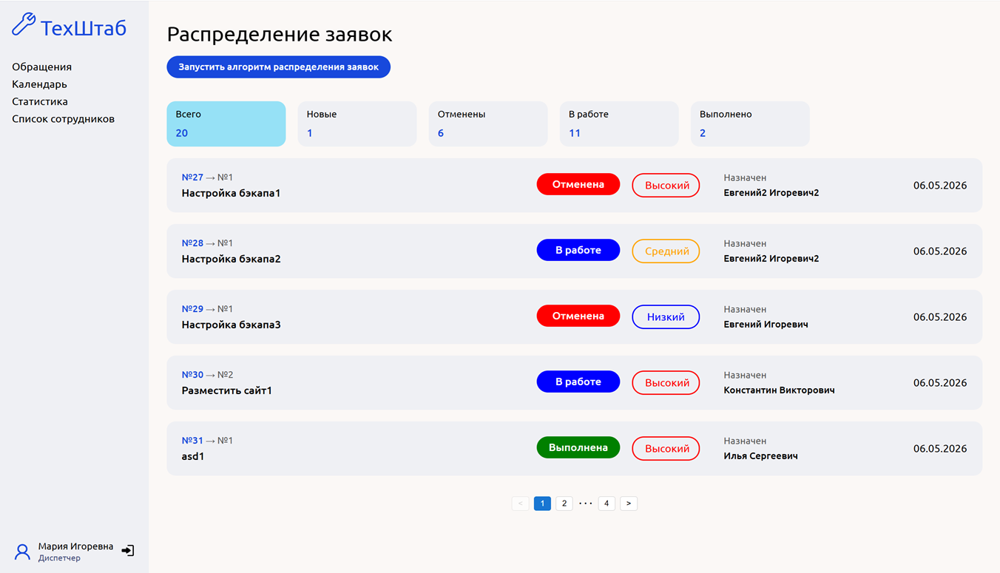

ТехШтаб — учебный проект системы диспетчеризации ремонтной линии и координации инженерной службы предприятия. Проект моделирует работу диспетчеров и инженеров при обработке неисправностей производственной линии.

## Цель проекта

Целью данного проекта является создание прототипа системы, позволяющей: 
1. Принимать обращение по неисправному оборудованию;
2. Распределение ресурсов по обработке заявок;
3. Отслеживать статусы работ;
4. Анализ заявок.

## Функционал
Реализованный функционал: 
1. Хранение заявок в системе;
2. Просмотр списка инженеров, обращений;
3. Алгоритм распределения заявок;
4. Просмотр в календере списка распределенных заявок.

## Скриншоты

Экран авторизации

Календарь с распределением

Список созданных заявок

Статус проекта: разработан. Создается в рамках обучения по дисциплине "Программная инженерия". Не является промышленным решением, создается как демонстрационная модель.

Установка всех пакетов и зависимостей
npm install

Запуск
npm run dev

